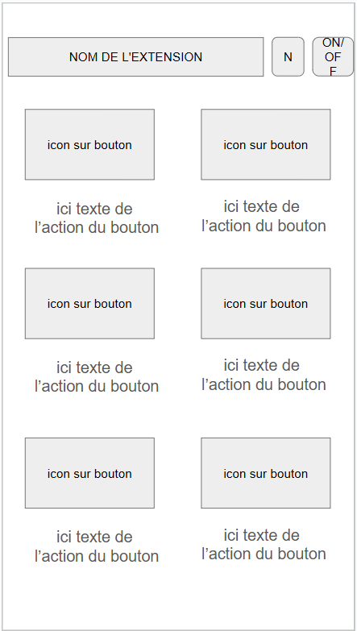
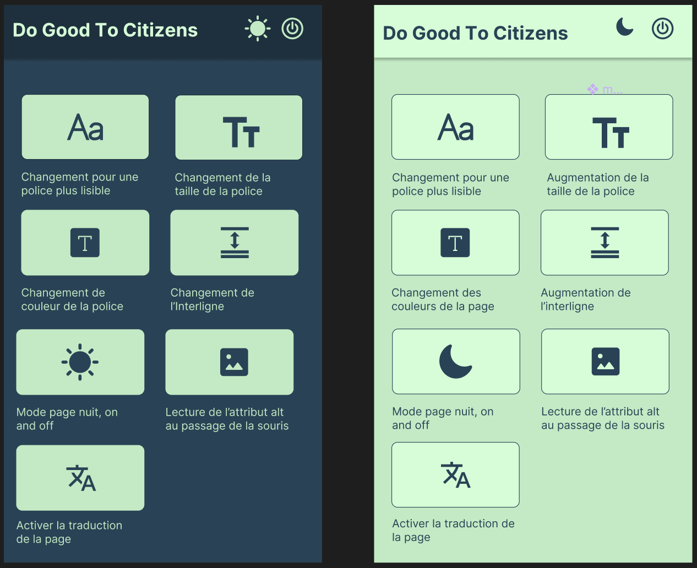

# OBJECTIFS individuels: 

- Collaboration - partage de tâches - amélioration niveau logique et algorithmique - 

- Mise en commun pour que chacun comprenne le code des autres

- Communication - Stand-up matin midi et rétrospective le soir - Prendre le temps d’expliquer son code 

# MÉTHODO DU PROJET :

- Temps de groupe aux moments clés de la journée (matin, début d’après-midi, clotûre)

- Poser les bases du projet en mob programming (via https://mobtime.hadrienmp.fr/):
    - respect du temps de clavier de chacun
    - respect du temps de pause 
    - faire appel aux personnes qui ne tapent pas pour faire des recherches ou aider

- Une branche par fonctionnalité 

- Prendre deux pauses par jour  (~ 11h, ~15h)

- Faire des maquettes (wireframe, appli)

- Suivre le backlog GITHUB du projet : https://github.com/orgs/adatechschool/projects/64 

# GIT FLOW : 

## Avant de commencer :
- git checkout dev : on se place sur la branche dev
- git pull origin dev : on s'assure de récupérer les mises à jour de la branche dev
- git branch feature/(nom-de-la-fonctionnalité) : on crée une nouvelle branche de fonctionnalité
- git checkout feature/(nom-de-la-fonctionnalité) : on se place sur la nouvelle branche de fonctionnalité

## Après avoir effectué des modifications :
- git add . : on ajoute les fichiers modifiés
- git commit -m "message" : on commit les modifications
- git push origin feature/(nom-de-la-fonctionnalité) : on push la branche de fonctionnalité sur DEV

En cas de conflit, on résout le conflit en local, on commit et on push à nouveau
Code review de la branche dev (en équipe)

# IDEE DE PROJET
La création d'une extension Chrome qui a pour but de rendre accessible tout type de site au plus grand nombre.

son nom : ** Do Good To Citizens ** 

## DÉTAILS DU MVP:

L'idée est de personnaliser toutes pages WEB:

- Changer la police (imposer la police Verdana)
- Changer la taille de la police (imposer la taille 24px pour plus de lisibilité)
- Changer la couleur (en utilisant ces couleurs classées AA pour l'accessibilité https://gradients.app/fr/legibility/63)
- Changer l'interlignage (imposer 1.8)

## APRÈS MVP : 
- Proposer mode nuit 
- Lire balises des images au hover de la souris
- Voix-off lecture de la page
- Lien avec une IA de traduction
- Créer une loupe
- Proposer des sous-titres si le site visité héberge des vidéos

## WIREFRAME

## MAQUETTE

https://www.figma.com/design/oyzzqkjJhz04koI6r62pPr/maquette-extension?node-id=0-1&p=f&t=7uPInT0hPuOj0guX-0

